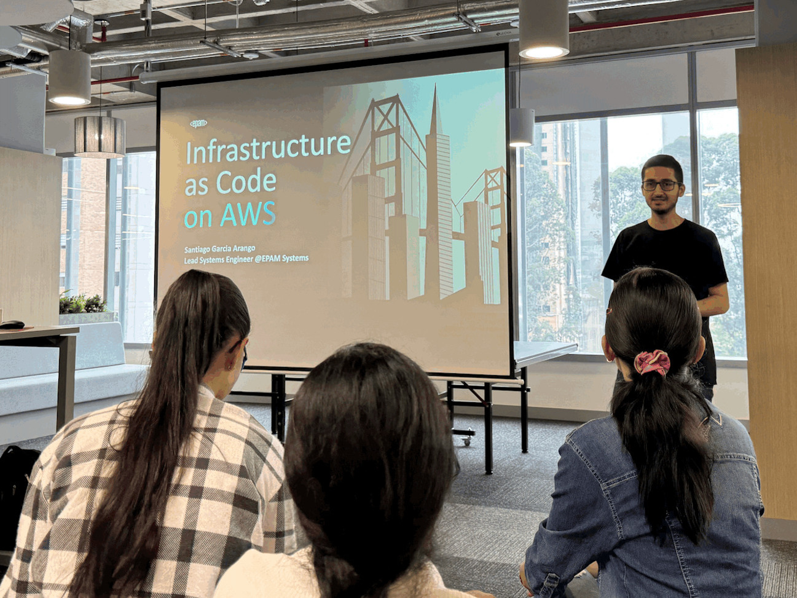
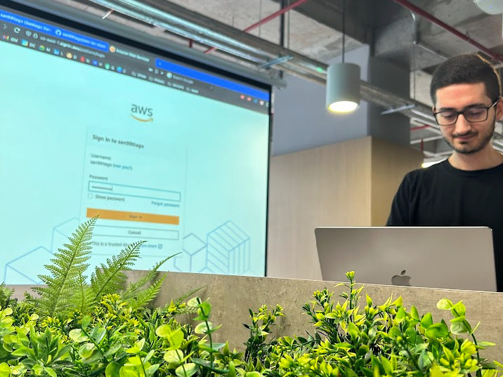

# 📈 AWS-IAC-STOCKS-DEMO 📈

This is an IaC Demo deployed on AWS that contains an API and ETL that process Stock Prices.

<!-- INTENTIONALLY REMOVING IMAGES

<br>

<br>
-->

## Architecture 🏦

 <br>

## Overview 🔮

- Infrastructure as Code with [AWS CDK-Python](https://aws.amazon.com/cdk/) or [Terraform](https://www.terraform.io)
- Source Code with [AWS Lambda Functions](https://aws.amazon.com/lambda/) built with [Python Runtime](https://www.python.org)
- ETL that downloads stock prices with [yfinance](https://pypi.org/project/yfinance/) (Yahoo Finance's API)
- [DynamoDB](https://aws.amazon.com/dynamodb/) as the NoSQL database for saving the stock prices
- Python dependencies managed by [requirements.txt](./requirements.txt)
- Tests with [PyTest Framework](https://docs.pytest.org/)

## How to run this project? :dizzy:


### Manual Deployment Instructions (University EIA Demo)

---
... ACCESO A CUENTA DE AWS ...

1. Login al Sandbox de AWS:

- https://san99tiago.awsapps.com/start

---
... CREACIÓN DE BASE DE DATOS ...

2. Ir al servicio "DynamoDB" y crea una tabla. Elige el nombre que desees.

- Recuerda el nombre de la tabla, lo necesitaremos!!

---
... CREACIÓN DE ETL ...

3. Ir al servicio de "Lambda" y crea una función. Elige el nombre que desees (`etl-<nombre>`).

- Elige el rol: `DEMO_ROLE_UNIVERSIDAD_EIA_SELECCIONAME`

4. Ve a la parte de abajo de "Lambda" y agrega una "Lambda Layer" (ARN), copiando esto:

- `arn:aws:lambda:us-east-1:226584130046:layer:python3-12-yfinance:1`

5. Ve al siguiente archivo y copia/pega el código en la función Lambda:

- [./src/etl/lambda_function.py](./src/etl/lambda_function.py)

6. Actualiza las siguientes líneas por el Ticker que quieras (acción/etl/quote):

- `os.environ["STOCK_TICKER"]` por el ticker. Ejemplo --> `BTC-USD`
- `os.environ["DYNAMODB_TABLE"]` por el nombe de la tabla (paso 2). Ejemplo --> `tabla-santi`

7. En la parte superior de la Lambda, selecciona "Add Trigger". Escribe "Schedule", y selecciona "EventBridge". Crea una regla (elige nombre). y selecciona "Schedule expression".

- Escribe en la regla: `rate(1 minute)`
- Click en "Agregar" (crear regla)

8. Ve a configuraciones de la Lambda de ETL. Selecciona "Configuration". Luego selecciona "General Configuration" y actualiza el "Timeout" de ejecución para que sea `30 segundos`.

9. Procede a ir a la tabla de DynamoDB y verifica que cada 1 minuto, se vayan agregando nuevos items. (ETL funcional en este paso).

---
... CREACIÓN DE API ...

10. Ir al servicio de "Lambda" y crea una función. Elige el nombre que desees (`api-<nombre>`).

- Elige el rol: `DEMO_ROLE_UNIVERSIDAD_EIA_SELECCIONAME`
- En opciones avanzadas, elige "Enable function URL". Auth type --> None. Otras opciones "Default".

11. Ve al siguiente archivo y copia/pega el código en la función Lambda:

- [./src/api/lambda_function.py](./src/api/lambda_function.py)

12. Actualiza las siguientes líneas por el Ticker que elegiste en el paso 6 (acción/etl/quote):

- `os.environ["STOCK_TICKER"]` por el ticker. Ejemplo --> `BTC-USD`
- `os.environ["DYNAMODB_TABLE"]` por el nombe de la tabla (paso 2). Ejemplo --> `tabla-santi`

13. Procede a ir a la parte superior donde dice "Function URL" y dale click al link azul. Este es el API que está habilitado para exponer las acciones.

---

### Infrastructure as Code Deployment

(Optional) Login to your AWS Account, and go to the "[Cloud9](https://us-east-1.console.aws.amazon.com/cloud9control/home?region=us-east-1#/)" service. Then proceed to "create an environment", and use these settings (default):

- Name: _Choose the preferred name_
- Environment type: New EC2 instance
- Instance type: t2.micro (1 GiB RAM + 1 vCPU)
- Platform: Amazon Linux 2023
- Timeout: 30 minutes
- Connection: AWS Systems Manager (SSM)

Now, wait for the environment to be ready, select it, and click on "Open in Cloud9" to access it.

Once in your Cloud9 environment, you can proceed to clone the repository as follows:

```bash
git clone https://github.com/san99tiago/aws-iac-stocks-demo
cd aws-iac-stocks-demo
```

Proceed to install the Python dependencies:

```bash
pip install -r requirements.txt
```

To deploy the solution (with the help of [Cloud Development Kit](https://aws.amazon.com/cdk/)), you can run:

```bash
cdk deploy
# Approve (press "y")
```

| This command will create a CloudFormation Stack that contains the Infrastructure as Code for the necessary AWS resources.

### What is going on now?

- First, you can go to "CloudFormation" service, and search for the stack. Inside the stack, in the "Resources" tab, you will find:

  - DynamoDB-Table: NoSQL Database that will store the Stock prices over time.
  - EventBridge-Rule: Enables to periodically run the ETL (eg: every 5 minutes).
  - Lambda-ETL-Stocks: Runtime for the Extract-Transform-Load logic to fetch and save the stock prices periodically.
  - Lambda-API-Stocks: Runtime for the API that exposes the latest stock prices.

 <br>

- Second, you can go to "DynamoDB", and check the DynamoDB table that has a prefix `stock-prices-stocks-demo-***`, and click on "Explore Table Items", to see how the data gets loaded to the table as items with datetime and additional attributes.

 <br>

- Finally, you can use the `LambdaFunctionUrl` (that is the generated Output in the CloudFormation Stack), to execute the API that is able to get the latest stock prices from the DynamoDB table and return them in a specific format ready to be used by other consumers/users/systems.

 <br>

### Destroy (To avoid costs)

To destroy/remove the resources, run:

```bash
cdk destroy
# Approve (press "y")
```

## Special thanks 🎁

- Thanks to all contributors of the great OpenSource projects that I am using. <br>

## Author 🎹

### Santiago Garcia Arango

<table border="1">
    <tr>
        <td>
            <p align="center">Curious DevOps Engineer passionate about advanced cloud-based solutions and deployments in AWS. I am convinced that today's greatest challenges must be solved by people that love what they do.</p>
        </td>
        <td>
            <p align="center"></p>
        </td>
    </tr>
</table>

## LICENSE

Copyright 2024 Santiago Garcia Arango.
